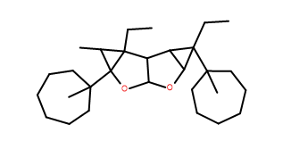

  

# protacSpace
A repository for generating virtual PROTACS and exploring their chemical spaces.

## How to use:
1. Please clone the repo in your local machine or use mybinder.org.
2. Execute the cells in protac_enumeration.ipynb file.

## Related project: https://www.proxidrugs.de/

More stuffs to come. Stay tuned!!

